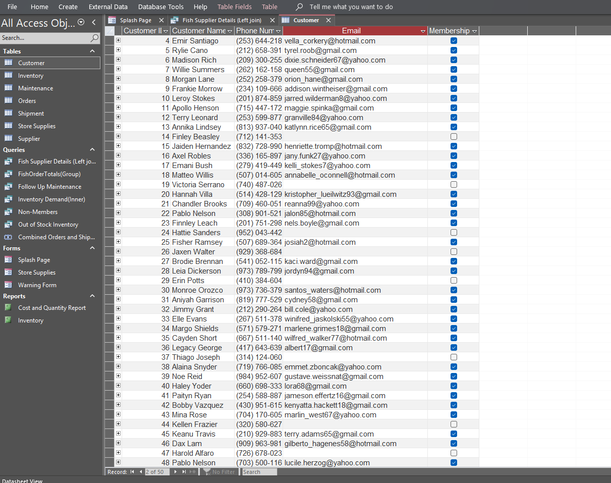

# Retail Operations Database

This project is a Microsoft Access database built for a mock retail store (Fin & Reef).  
It manages suppliers, customers, orders, and inventory, with queries, reports, and forms to support day-to-day operations.

## Features
- Relational tables for suppliers, customers, orders, inventory
- Queries for stock tracking and cost reporting
- Reports for inventory and cost analysis
- User-friendly splash page for navigation

## Screenshots

## How to Run
1. Download `Retail_Operations_DB.zip` from this repo
2. Extract the file
3. Open `Retail_Operations_DB.accdb` in Microsoft Access (no password required)
